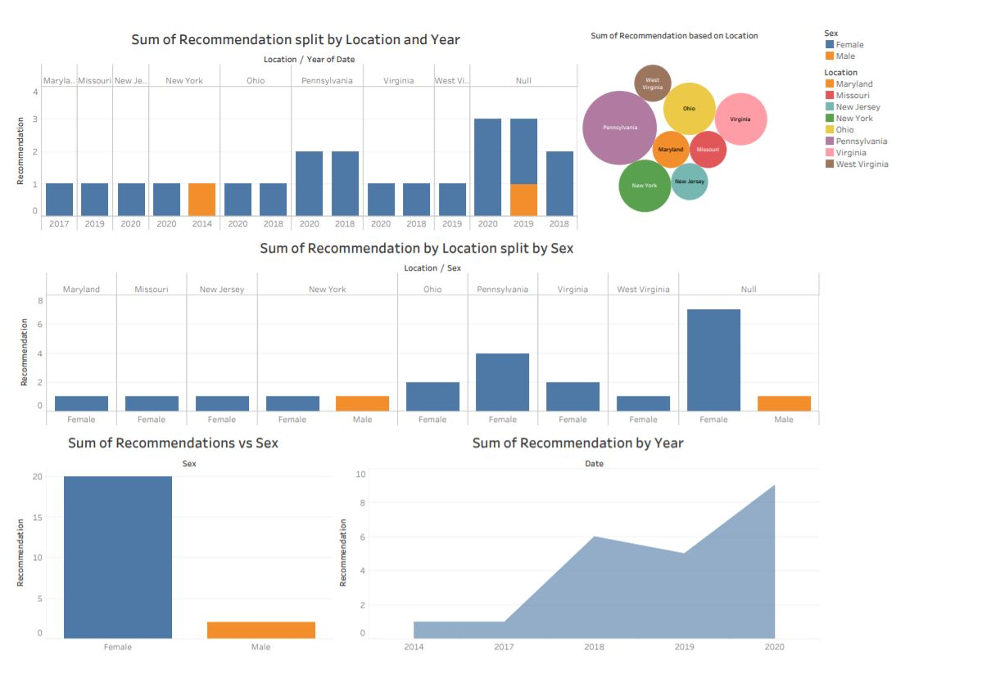

# Brightfarms_Native

In this Preoject I did a customer Insight Of a company Called BrightFarms. Bright Farms is a indoor Farming Company. It grows and supplies local non-GMO , Pesticide free and fresh salad greens.

The analysis consists of three parts. 
<ol>
<li> Data scrapping 
<li> Data cleaning
<li> Data Visualisation
</ol>

<h2> Data Scrapping </h2>
For collecting data, I started searching for customer review on portal that sell the BrrightFarms Products. Unfortunately only one proudct had review, with only 3 reviews from all the portals.
As this was not enough I started searching on review on Social media. Twitter had some reviews and facebook had around 20 reviews of brightfarms itself. 
I tried Scrapping data on twitter, but twitter API only lets the developer scap data for one week, scapping old data is a paid feature and other python API were also not helpful(getoldTweets3 is not working because of changes in twitter).

Still on scrapping data from twitter for the above mentioned limitation(twitter_scrap.py), I got 18 tweets all of which were articles about the lates investment in brightfarms  by Cox Enterprise and was not useful for customer analysis. 
After this, I tried scrapping information from python but as the Facebook API does not allow data to be scrapped for other pages, I used a online tool called 'APIFY', which gave me all the reviews on Brightfarms from facebook.
The information recieved was not complete and need some manual inputs. (NOT recommended for very large data sets). 
Thus now I had the data for brightfarms.

<h2> Data Cleaning </h2>

The data needed to be cleaned. I cleaned the data, did a analysis on the reviews like the most word used for the postive or negative Review. lowercase all the words, LabelEncoding the data.

The cleaned data was then dumped to CSV file to do a data visualisation on Tableau

<h2> Data Visualisation </h2>

The cleaned data file was loaded on tableau and different graphs were created to be added on the final dashboard.
The final dashboard is as shown below:

 

<h2> Things that can be improved <h2>
1. The twitter API offers a deveoper access to old data for free using cUrl sandbox Which I found a bit late and perhaps some more tweets can be found using this approach. 
2. I was asked to accumulate data from atleast 2 sources but as I was unable to access data from the twitter and there were no reviews for product on the portals like walmart, the data is only from one source. 
3. Using BeautifulSoup and selenium the process of getting data from facebook can be done using python instead of depending on the APIFY.
